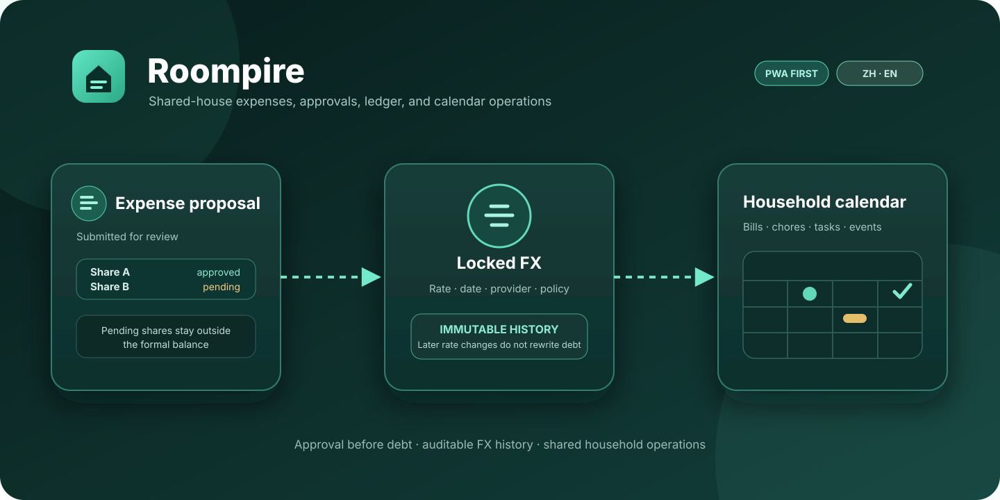
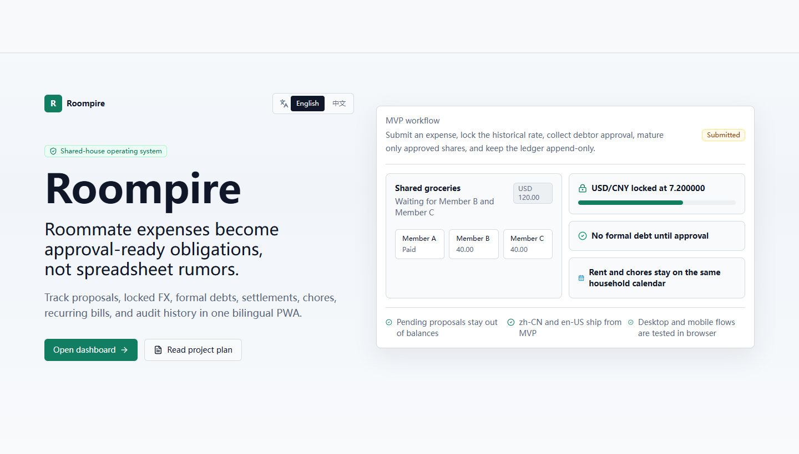
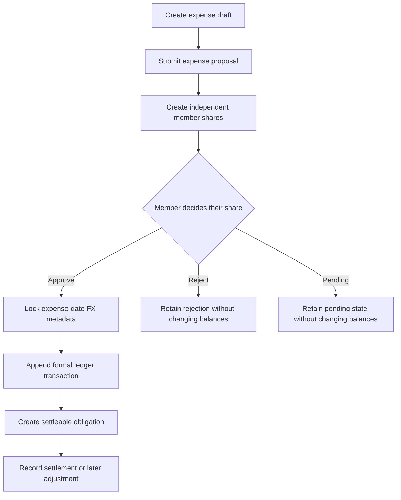
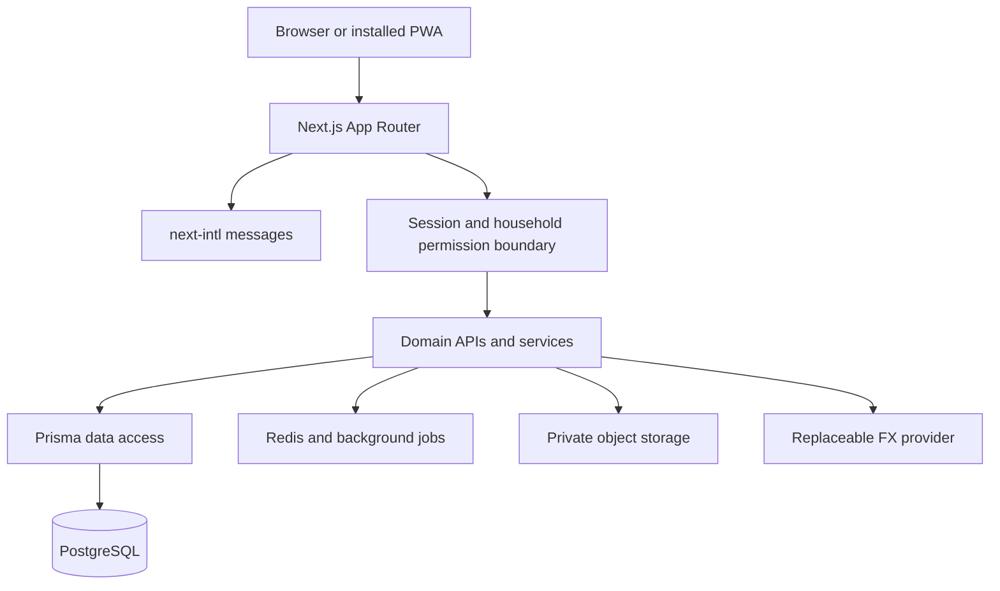

<div align="center">
  

# Roompire

**Turn shared-house expenses from verbal agreements into reviewable, traceable, and recoverable records**

<sub>PWA first · Chinese and English · debt becomes formal only after approval · currently Phase 0</sub>


[简体中文](README.md) · [Current scope](#2-current-phase) · [Preview](#3-interface-preview) · [Local setup](#9-local-setup) · [Documentation](#12-documentation-map)
</div>

<div align="center">
  <sub>Figure 1.1 — Roompire organizes shared living through expense proposals, locked FX, and a household calendar</sub>
</div>

## 1 Project Positioning

Roompire is a progressive web application for shared households. Its planned scope combines expense proposals, member approvals, historical FX, a formal debt ledger, settlements, calendar tasks, recurring bills, audit records, statistics, and backups [1].

Its defining rule is that a submitted expense is only a proposal. A member's share becomes formal debt only after that member approves it, separating “someone recorded an expense” from “the affected member accepted the obligation” [2].

The repository currently delivers the Phase 0 engineering foundation, not a production-ready financial system. Authentication, household isolation, role enforcement, the complete approval path, formal ledger behavior, and backup recovery remain future phases.

## 2 Current Phase

<div align="center">

Table 2.1 — Phase 0 implementation and future scope

| Capability | Implemented in Phase 0 | Future target |
| --- | --- | --- |
| Engineering | pnpm workspace, Turborepo, and Next.js App Router build successfully | Split services and shared packages by domain |
| Interface | Bilingual landing page, static dashboard shell, and forbidden state | Connect real household data and complete interactions |
| PWA | Manifest and application icon | Offline policy, installation UX, and mobile hardening |
| Data | Prisma models, initial migration, and deterministic fictional seed | Server authorization, business transactions, and production migration process |
| Expense approval | Data structures and product rules | Per-member approval, rejection, and partial maturity |
| FX and ledger | Locking policy and append-only rules | Provider integration and formal obligation generation |
| Quality | Unit, build, and real-browser smoke tests | Integration, accessibility, visual, and recovery tests |
| Production | Design documentation only, with invalid public placeholders | Private domain, secrets, backup, and monitoring configuration |

</div>

## 3 Interface Preview

<div align="center">
  

Figure 3.1 — Roompire's current landing page in a real browser, with neutral member placeholders
</div>

The interface uses a minimal SaaS style. The opening view explains approval-based expenses, locked FX, and shared scheduling, and navigation switches between `zh-CN` and `en-US` [3].

The screenshot comes from the current local build and contains no real users, households, addresses, deployment domains, or credentials.

## 4 Core Invariants

<div align="center">

Table 4.1 — Product invariants that implementations must preserve

| Rule | System behavior | Why it matters |
| --- | --- | --- |
| Submission is not debt | New expenses begin as proposals | One-sided entry cannot change another member's balance |
| Per-share approval | Each debtor controls only their own share | Preserves individual consent boundaries |
| Pending and rejected shares stay informal | They do not affect formal balances | Dashboard balances retain an explainable source |
| Formal ledger is append-only | Corrections use reversals or adjustments | Preserves the audit chain |
| Money uses decimal arithmetic | Calculations avoid JavaScript floating point | Reduces rounding and accumulation errors |
| FX defaults to expense-date lock | Proposals retain reviewable FX metadata | Reduces disputes caused by later rate movement |
| Household data must be isolated | Every household-scoped request requires server authorization | Prevents cross-household access |
| Bilingual from MVP | Chinese and English messages ship together | Avoids a structural localization retrofit |

</div>

## 5 Domain Flow

<div align="center">



Figure 5.1 — Only approved shares enter the formal debt path

</div>

This diagram describes the product target. Phase 0 implements related models, sample UI, and basic tests, while complete state transitions still require server-side services.

## 6 System Structure

<div align="center">



Figure 6.1 — Phase 0 implements the UI, localization, data model, and local service foundation

</div>

`apps/web` contains the Next.js application, `db` contains the Prisma model and initial migration, `specs` contains the OpenAPI contract skeleton, and root documentation preserves product, architecture, testing, security, and delivery decisions [3].

## 7 Data Model

<div align="center">

Table 7.1 — Responsibilities of the main model groups

| Model group | Representative objects | Responsibility |
| --- | --- | --- |
| Identity and household | User, Household, HouseholdMembership | Establish membership and future authorization boundaries |
| Expense proposal | ExpenseProposal, ExpensePayer, ExpenseShare | Record payers, participants, and pending shares |
| Approval | ProposalApproval, ProposalComment | Preserve decisions and discussion |
| FX | FxRate and proposal FX fields | Store source, time, and locked value |
| Formal ledger | LedgerTransaction, DebtObligation | Append formal events and derive settleable debt |
| Settlement | Settlement, SettlementAllocation | Record repayment and allocation |
| Collaboration | CalendarEvent, Task, Notification | Organize schedules, tasks, and reminders |
| Traceability | File, AuditEvent | Attach private files and preserve audit events |

</div>

The Prisma model passes schema validation, but model presence does not mean that the corresponding services exist. Later code must still enforce business transactions and server-side permissions [4].

## 8 Bilingual Experience

<div align="center">

Table 8.1 — Current interfaces and language coverage

| Interface | Chinese | English | Current data form |
| --- | :---: | :---: | --- |
| Product landing page | ✓ | ✓ | Localized static content |
| Dashboard shell | ✓ | ✓ | Anonymous sample data |
| Forbidden state | ✓ | ✓ | Static protected state |
| Language switcher | ✓ | ✓ | Preserves the corresponding page path |
| Complete business forms | Planned | Planned | Not implemented |

</div>

Interface messages live in `apps/web/src/i18n/messages`. New user-facing work must update both languages and use a real browser to verify layout and switching behavior.

## 9 Local Setup

You need Node.js, pnpm, and optionally Docker. Public documentation intentionally omits production domains, real database connection values, and account information.

1. Install dependencies from the lockfile.

```bash
pnpm install --frozen-lockfile # Install the reproducible dependency set
```

2. Start the local web development process.

```bash
pnpm dev # Start local development through Turborepo
```

3. Start local PostgreSQL and Redis containers when database work is needed.

```bash
docker compose up -d postgres redis # Start repository-defined local dependencies
```

4. Supply a private development database connection and validate or migrate the model.

```bash
pnpm db:validate # Validate the Prisma schema
pnpm db:migrate # Apply committed database migrations
pnpm db:seed # Insert repeatable fictional development data
```

The root database scripts use POSIX shell environment syntax. Windows users need an equivalent private environment injection method. Connection values should not enter shell history, README files, or commits.

If local host port mappings conflict with another process, override them through uncommitted environment variables instead of editing the committed Compose file.

## 10 Verification Results

<div align="center">

Table 10.1 — Checks executed against the current branch on 2026-08-24

| Check | Result | Evidence scope |
| --- | --- | --- |
| Dependency install | Passed | 538 workspace packages installed and lockfile supply-chain policy passed |
| ESLint | Passed | No workspace lint errors |
| TypeScript | Passed | No workspace type errors |
| Vitest | Passed | 1 file and 3 decimal split tests |
| Next.js build | Passed | Next.js 16.2.10 generated landing, dashboard, state, API, and manifest routes |
| Prisma schema | Passed | Validated with equivalent Windows environment injection |
| Playwright | Passed | 4 Chromium desktop and mobile real-browser checks |
| GitHub Actions CI | Passed | Remote install, lint, type, unit-test, and build stages completed |
| GitHub Actions E2E | Passed | Remote containers, database, build, and all 4 real-browser tests completed |
| Format check | Environment difference | Windows working-tree line endings are reported by Prettier; no broad rewrite was applied |

</div>

The test plan makes real-browser flows the primary acceptance evidence for visible UI work. Future features should add success, failure, mobile, and bilingual paths [5].

```bash
pnpm lint # Check lint rules
pnpm typecheck # Check TypeScript types
pnpm test # Run Vitest unit tests
pnpm build # Build the production application
pnpm e2e # Start the test web app and run desktop and mobile browser flows
```

## 11 Security Boundaries

<div align="center">

Table 11.1 — Current public-repository privacy and security boundaries

| Object | Current handling | Delivery requirement |
| --- | --- | --- |
| Deployment domain | Current branch uses only an `.invalid` placeholder | Keep real domains in private deployment configuration |
| Database and service credentials | README provides no real connection values | Use encrypted deployment secret management |
| Sample members and households | Screenshot is anonymized and seed data is development-only | Never reuse real user records |
| Receipts and attachments | Upload is not implemented | Private storage, short-lived signed access, and type validation |
| Household isolation and RBAC | Requirements only | Validate every household-scoped read and write on the server |
| Financial data | No cards, identity documents, or payment authorization | Record only household-recognized expense and settlement facts |
| Backup and restore | Design and acceptance criteria only | Complete encrypted backups and restore drills before launch |

</div>

The security design calls for least privilege, server authorization, audit integrity, secret isolation, and recovery exercises. A Phase 0 interface foundation is not evidence that those controls are complete [6].

If older commits contain deployment identifiers, cleaning the current branch does not rewrite Git history. History rewriting requires separate authorization, an impact review, and a credential rotation plan.

## 12 Documentation Map

<div align="center">

Table 12.1 — Repository sources of truth and maintenance entry points

| File | Contents |
| --- | --- |
| [`AGENTS.md`](AGENTS.md) | Repository rules and non-negotiable constraints |
| [`PROJECT_MEMORY.md`](PROJECT_MEMORY.md) | Current phase, persistent decisions, and session evidence |
| [`docs/00_context_decisions.md`](docs/00_context_decisions.md) | Context, target environment, and product principles |
| [`docs/01_project_plan.md`](docs/01_project_plan.md) | Phases, delivery gates, and risks |
| [`docs/02_prd.md`](docs/02_prd.md) | Users, requirements, and MVP scope |
| [`docs/03_technical_design.md`](docs/03_technical_design.md) | Architecture, domain flows, and deployment design |
| [`docs/04_test_plan.md`](docs/04_test_plan.md) | Unit, integration, browser, and recovery strategy |
| [`docs/05_database_design.md`](docs/05_database_design.md) | Tables, enums, and data invariants |
| [`docs/06_api_specification.md`](docs/06_api_specification.md) | API groups, request shapes, and authorization matrix |
| [`specs/openapi.roompire.v1.yaml`](specs/openapi.roompire.v1.yaml) | OpenAPI contract skeleton |
| [`docs/07_ui_ux_spec.md`](docs/07_ui_ux_spec.md) | Page structure, visual language, and bilingual UX [7] |
| [`docs/08_coding_standards_tech_stack.md`](docs/08_coding_standards_tech_stack.md) | Technology, code, and security rules |
| [`docs/09_agent_instructions_workflow.md`](docs/09_agent_instructions_workflow.md) | Branch, test, and handoff workflow |
| [`docs/10_backlog_milestones.md`](docs/10_backlog_milestones.md) | Priorities, epics, and suggested delivery slices |
| [`docs/11_security_privacy_backup.md`](docs/11_security_privacy_backup.md) | Threat model, privacy, backup, and recovery |
| [`docs/12_acceptance_checklist.md`](docs/12_acceptance_checklist.md) | Definition of Done and acceptance gates [8] |
| [`docs/13_sources.md`](docs/13_sources.md) | Official references used for technical choices |

</div>

## 13 Roadmap

<div align="center">

Table 13.1 — Staged path from engineering foundation to a verifiable product

| Phase | Main target | Required boundary |
| --- | --- | --- |
| Phase 1 | Sessions, households, members, invites, and roles | Reject cross-household and unauthorized operations on the server |
| Phase 2 | Expense proposals, splits, and per-member approval | Pending or rejected shares must never change formal balances |
| Phase 3 | Historical FX, append-only ledger, and settlements | Amount, rate, and reversal chain must be reviewable |
| Phase 4 | Calendar, recurring bills, tasks, and reminders | Time, timezone, and recurrence behavior must be explicit |
| Phase 5 | Statistics, audit, export, and administration | Derived results must trace back to formal ledger records |
| Phase 6 | PWA, mobile, and accessibility hardening | Real-device and recovery scenarios must pass |
| Phase 7 | Private deployment, monitoring, backup, and restore | Restore drills must meet project targets |
| Phase 8 | Optional clients and enhancements | Existing domain invariants must remain intact |

</div>

The practical next sequence is to implement identity, household, and authorization boundaries, then replace static dashboard data with server data, and only then start the expense proposal workflow.

## 14 Known Limitations

- Business figures shown in the current UI are anonymous examples, not persistent account state.

- The current session route, dashboard, and forbidden page do not replace complete authentication and role enforcement.

- The data model and OpenAPI file are evolvable foundations and may change before services are implemented.

- The repository provides no production deployment evidence, restore report, performance baseline, or security audit conclusion.

- Some root scripts use POSIX shell syntax, so Windows execution requires equivalent environment injection.

## 15 Contribution Workflow

1. Read `AGENTS.md`, `PROJECT_MEMORY.md`, and the design documents relevant to the change.

2. Create a focused feature branch from the current default branch and use Conventional Commits.

3. Implement one reviewable result at a time and maintain both Chinese and English UI.

4. Run lint, type checks, unit tests, build, and real-browser flows.

5. Update `PROJECT_MEMORY.md` with changes, evidence, known issues, and the next recommended task.

Changes involving financial invariants, household isolation, destructive data operations, or deployment secrets require additional review.

## 16 License Status

This repository does not currently include a license file. Public visibility does not grant permission to copy, modify, or redistribute the work. Obtain authorization until the maintainers add an explicit license.

## 17 References

[1] AIALRA-0, “Product Requirements Document,” `docs/02_prd.md`, Roompire repository, 2026.

[2] AIALRA-0, “Persistent Project Memory,” `PROJECT_MEMORY.md`, Roompire repository, 2026.

[3] AIALRA-0, “Technical Design Document,” `docs/03_technical_design.md`, Roompire repository, 2026.

[4] AIALRA-0, “Prisma Schema,” `db/schema.prisma`, Roompire repository, 2026.

[5] AIALRA-0, “Test Plan,” `docs/04_test_plan.md`, Roompire repository, 2026.

[6] AIALRA-0, “Security, Privacy, Backup, and Recovery,” `docs/11_security_privacy_backup.md`, Roompire repository, 2026.

[7] AIALRA-0, “UI/UX Spec and Design System,” `docs/07_ui_ux_spec.md`, Roompire repository, 2026.

[8] AIALRA-0, “Acceptance Checklist,” `docs/12_acceptance_checklist.md`, Roompire repository, 2026.
