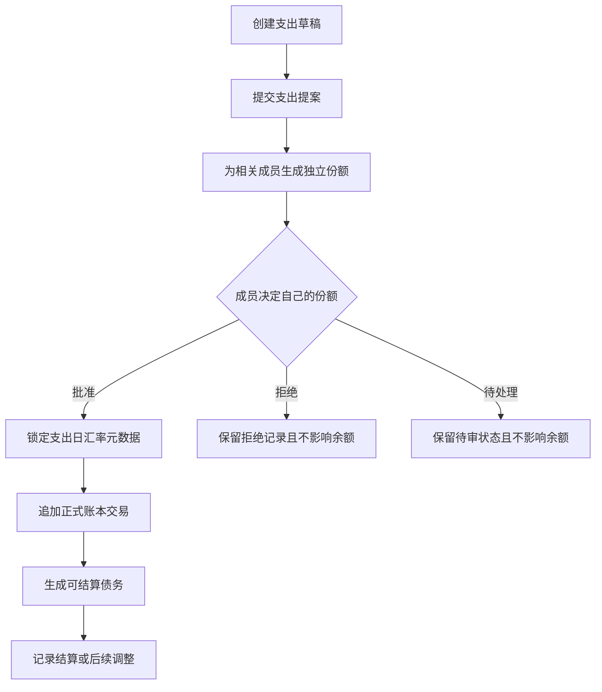
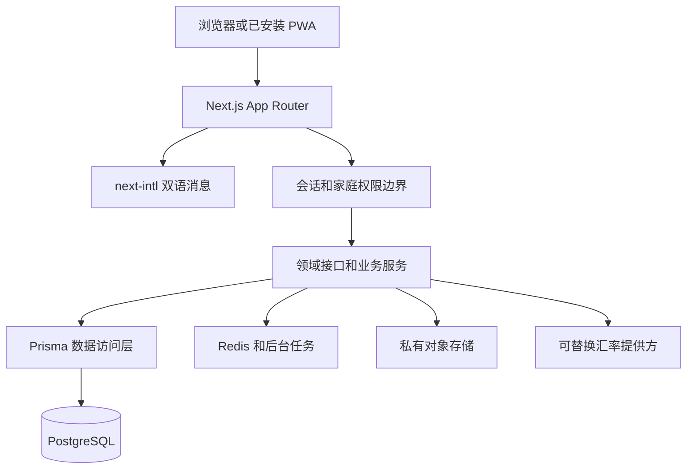

<div align="center">
  

# Roompire

**把合租支出从口头约定变成可审核、可追溯、可恢复的共同记录**

<sub>PWA 优先 · 中文和英文双语 · 审批后才形成正式债务 · 当前为工程骨架</sub>


[English](README.en.md) · [当前能力](#2-当前阶段) · [界面预览](#3-界面预览) · [本地运行](#9-本地运行) · [文档导航](#12-文档导航)
</div>

<div align="center">
  <sub>图 1.1　Roompire 用支出提案、锁定汇率和共享日程组织合租协作</sub>
</div>

## 1 项目定位

Roompire 是一套面向合租家庭的渐进式 Web 应用，它计划统一管理支出提案、成员审批、历史汇率、正式债务、结算、日历任务、周期账单、审计记录、统计和备份 [1]

项目最重要的规则是，成员提交的支出只是提案，只有相关成员批准的份额才能进入正式账本 [2]

这条规则把“有人记录了一笔钱”和“其他成员正式认可债务”分成两个可追溯事件

当前仓库交付的是 Phase 0 工程骨架，不是完整可投入生产的财务系统 [2]

身份认证、家庭隔离、权限控制、完整审批链、正式账本和备份恢复仍属于后续阶段

## 2 当前阶段

<div align="center">

表 2.1　Phase 0 已实现能力和后续目标

| 能力域 | Phase 0 当前状态 | 后续目标 |
| --- | --- | --- |
| 工程结构 | pnpm 工作区、Turborepo、Next.js App Router 已可构建 | 按领域拆分服务和共享包 |
| 用户界面 | 双语落地页、静态仪表盘和无权限状态页已实现 | 接入真实家庭数据和完整交互 |
| 渐进式 Web 应用 | Manifest 和应用图标已提供 | 完成离线策略、安装体验和移动端加固 |
| 数据层 | Prisma 模型、初始迁移和确定性虚构种子已提供 | 接入服务端授权、业务事务和生产迁移流程 |
| 支出审批 | 数据结构和产品规则已经定义 | 实现逐成员审批、拒绝和部分成熟 |
| 汇率和账本 | 锁定策略和追加式账本规则已经定义 | 接入汇率提供方并生成正式债务 |
| 质量验证 | 单元、构建和真实浏览器冒烟测试已通过 | 增加集成、可访问性、视觉和恢复演练 |
| 生产部署 | 只保留设计说明，公开材料使用无效占位域名 | 在私有配置中完成域名、密钥、备份和监控 |

</div>

## 3 界面预览

<div align="center">
  

图 3.1　真实浏览器中的 Roompire 落地页，成员名称已替换为中立占位符 [3]
</div>

界面采用简洁的软件即服务产品风格，首屏直接解释审批式支出、锁定汇率和共享日程，导航可切换 `zh-CN` 和 `en-US` [3]

截图来自当前代码的本地构建，没有展示真实用户、家庭、地址、部署域名或凭据

## 4 核心原则

<div align="center">

表 4.1　Roompire 不可破坏的业务不变量

| 规则 | 系统行为 | 为什么重要 |
| --- | --- | --- |
| 提交不等于欠款 | 新支出先进入提案状态 | 防止单方记账直接改变他人余额 |
| 逐份额审批 | 每名债务人只决定自己的份额 | 保留个人同意边界 |
| 待审和拒绝不入账 | 未批准份额不影响正式余额 | 让仪表盘余额具有清晰来源 |
| 正式账本只追加 | 更正通过冲销或调整记录完成 | 保留完整审计链 |
| 金额使用十进制定点运算 | 金额计算避开 JavaScript 浮点数 | 降低舍入误差和累计偏差 |
| 汇率默认按支出日锁定 | 提案保存可复核的汇率元数据 | 降低结算日波动引发的争议 |
| 家庭数据必须隔离 | 所有家庭级访问都要经过服务端授权 | 防止跨家庭读取或修改数据 |
| 双语从最小版本开始 | 界面同时维护中文和英文消息 | 避免后期补做国际化造成结构返工 |

</div>

## 5 业务流程

<div align="center">



图 5.1　目标审批流程中只有已批准份额能够形成正式债务

</div>

这张图描述产品目标流程，Phase 0 只实现相关模型、示例界面和部分基础测试 [2]

完整状态转换仍需在服务端完成

## 6 系统结构

<div align="center">



图 6.1　Phase 0 已落地界面、国际化、数据模型和本地服务骨架，尚未实现的节点按阶段接入 [2]

</div>

`apps/web` 保存 Next.js 应用，`db` 保存 Prisma 模型和初始迁移，`specs` 保存 OpenAPI 契约骨架，根目录文档保存产品、架构、测试、安全和交付决策 [3]

## 7 数据模型

<div align="center">

表 7.1　关键模型在业务链中的责任

| 模型组 | 代表对象 | 责任 |
| --- | --- | --- |
| 身份和家庭 | User、Household、HouseholdMembership | 建立成员归属和后续授权边界 |
| 支出提案 | ExpenseProposal、ExpensePayer、ExpenseShare | 保存谁付款、谁参与以及各自待确认份额 |
| 审批记录 | ProposalApproval、ProposalComment | 保存成员决定和沟通过程 |
| 汇率 | FxRate 和提案汇率字段 | 保存来源、时间和锁定值 |
| 正式账本 | LedgerTransaction、DebtObligation | 追加正式交易并派生可结算债务 |
| 结算 | Settlement、SettlementAllocation | 记录实际偿还及其分配 |
| 协作 | CalendarEvent、Task、Notification | 组织日程、任务和提醒 |
| 可追溯性 | File、AuditEvent | 关联私有附件并保存审计事件 |

</div>

Prisma 模型当前已经通过语法验证，但模型存在不代表对应服务已经实现，业务事务和服务端权限仍需后续代码保证 [4]

## 8 双语体验

<div align="center">

表 8.1　当前可见界面和语言支持

| 界面 | 中文 | 英文 | 当前数据形态 |
| --- | :---: | :---: | --- |
| 产品落地页 | ✓ | ✓ | 本地化静态内容 |
| 仪表盘骨架 | ✓ | ✓ | 匿名示例数据 |
| 无权限状态页 | ✓ | ✓ | 静态保护状态 |
| 语言切换 | ✓ | ✓ | 保留对应页面路径 |
| 完整业务表单 | 规划中 | 规划中 | 尚未实现 |

</div>

界面消息集中在 `apps/web/src/i18n/messages`，新增用户界面时需要同时补齐两种语言，并通过真实浏览器检查布局和切换行为

## 9 本地运行

需要 Node.js、pnpm 和可选的 Docker 环境，公开文档不提供生产域名、真实数据库连接值或任何账户信息

- 第一步，安装锁文件中声明的依赖

```bash
pnpm install --frozen-lockfile # 按锁文件安装可复现依赖
```

- 第二步，启动本地网页开发进程

```bash
pnpm dev # 启动 Turborepo 管理的本地开发服务
```

- 第三步，需要数据库能力时启动本地 PostgreSQL 和 Redis 容器

```bash
docker compose up -d postgres redis # 启动仓库定义的本地依赖服务
```

- 第四步，在私有环境变量中提供开发数据库连接后验证或迁移模型

```bash
pnpm db:validate # 验证 Prisma 模型结构
pnpm db:migrate # 应用已经提交的数据库迁移
pnpm db:seed # 写入可重复执行的虚构开发数据
```

根脚本中的数据库环境变量写法面向 POSIX Shell，Windows 用户需要使用等价的私有环境变量注入方式，连接值不应写入命令历史、README 或提交记录

本地服务发生宿主机端口冲突时，可通过未提交的环境变量覆盖映射值，不需要修改仓库内 Compose 文件

## 10 验证结果

<div align="center">

表 10.1　2026-08-24 对当前分支执行的验证

| 检查 | 结果 | 证据范围 |
| --- | --- | --- |
| 依赖安装 | 通过 | 538 个工作区依赖包完成安装，锁文件供应链策略检查通过 |
| ESLint | 通过 | 全工作区静态检查无错误 |
| TypeScript | 通过 | 全工作区类型检查无错误 |
| Vitest | 通过 | 1 个测试文件、3 项金额均分测试通过 |
| Next.js 构建 | 通过 | Next.js 16.2.10 生成落地页、仪表盘、状态页、接口和 Manifest 路由 |
| Prisma 模型 | 通过 | 使用 Windows 等价环境注入完成模型验证 |
| Playwright | 通过 | Chromium 桌面端和移动端共 4 项真实浏览器测试通过 |
| 格式检查 | 存在环境差异 | Windows 工作树的换行符导致 Prettier 报告，未执行会放大差异的全仓库重写 |

</div>

测试计划把真实浏览器流程放在用户界面验收的优先位置，后续每个可见功能都应增加成功路径、失败路径、移动端和双语行为 [5]

```bash
pnpm lint # 检查代码规范
pnpm typecheck # 检查 TypeScript 类型
pnpm test # 运行 Vitest 单元测试
pnpm build # 构建生产模式应用
pnpm e2e # 启动测试网页并运行桌面端和移动端浏览器流程
```

## 11 安全边界

<div align="center">

表 11.1　公开仓库当前遵循的安全和隐私边界

| 对象 | 当前处理 | 后续交付要求 |
| --- | --- | --- |
| 部署域名 | 当前分支只使用 `.invalid` 占位域名 | 真实域名只保存在私有部署配置 |
| 数据库和服务凭据 | README 不提供真实连接值 | 使用部署平台的加密秘密管理 |
| 示例成员和家庭 | 截图匿名化，种子数据仅用于开发 | 禁止复用真实用户资料 |
| 收据和附件 | 当前尚未提供上传能力 | 私有对象存储、短期签名访问和类型校验 |
| 家庭隔离和权限 | 当前只是明确要求 | 所有家庭级读写必须在服务端验证 |
| 财务信息 | 项目不处理银行卡、证件或支付授权 | 只记录家庭内部认可的支出和结算事实 |
| 备份和恢复 | 当前只有设计和验收要求 | 上线前完成加密备份和恢复演练 |

</div>

安全设计要求最小权限、服务端授权、审计完整性、秘密隔离和恢复演练，Phase 0 的界面骨架不能作为这些控制已经完成的证据 [6]

如果历史提交曾包含部署标识，当前分支的清理不会自动改写 Git 历史，历史重写需要独立授权、影响评估和凭据轮换计划

## 12 文档导航

<div align="center">

表 12.1　仓库事实来源和维护入口

| 文件 | 内容 |
| --- | --- |
| [`AGENTS.md`](AGENTS.md) | 仓库级工作规则和不可破坏约束 |
| [`PROJECT_MEMORY.md`](PROJECT_MEMORY.md) | 当前阶段、持久决策和会话验证记录 |
| [`docs/00_context_decisions.md`](docs/00_context_decisions.md) | 项目背景、目标环境和产品原则 |
| [`docs/01_project_plan.md`](docs/01_project_plan.md) | 分阶段计划、验收门和风险 |
| [`docs/02_prd.md`](docs/02_prd.md) | 用户、功能需求和最小版本范围 |
| [`docs/03_technical_design.md`](docs/03_technical_design.md) | 架构、领域流程和部署设计 |
| [`docs/04_test_plan.md`](docs/04_test_plan.md) | 单元、集成、浏览器和恢复测试策略 |
| [`docs/05_database_design.md`](docs/05_database_design.md) | 表结构、枚举和数据不变量 |
| [`docs/06_api_specification.md`](docs/06_api_specification.md) | 接口分组、请求形状和授权矩阵 |
| [`specs/openapi.roompire.v1.yaml`](specs/openapi.roompire.v1.yaml) | OpenAPI 契约骨架 |
| [`docs/07_ui_ux_spec.md`](docs/07_ui_ux_spec.md) | 页面结构、视觉语言和双语体验 [7] |
| [`docs/08_coding_standards_tech_stack.md`](docs/08_coding_standards_tech_stack.md) | 技术栈、代码和安全规则 |
| [`docs/09_agent_instructions_workflow.md`](docs/09_agent_instructions_workflow.md) | 分支、测试和交接流程 |
| [`docs/10_backlog_milestones.md`](docs/10_backlog_milestones.md) | 优先级、史诗和建议交付切片 |
| [`docs/11_security_privacy_backup.md`](docs/11_security_privacy_backup.md) | 威胁模型、隐私、备份和恢复 |
| [`docs/12_acceptance_checklist.md`](docs/12_acceptance_checklist.md) | 完成定义和交付验收门 [8] |
| [`docs/13_sources.md`](docs/13_sources.md) | 技术选型使用的官方来源 |

</div>

## 13 迭代计划

<div align="center">

表 13.1　从工程骨架到可验证产品的阶段路线

| 阶段 | 主要目标 | 必须通过的边界 |
| --- | --- | --- |
| Phase 1 | 会话、家庭、成员、邀请和角色权限 | 跨家庭访问和越权操作必须被服务端拒绝 |
| Phase 2 | 支出提案、分摊和逐成员审批 | 待审或拒绝份额不得改变正式余额 |
| Phase 3 | 历史汇率、追加式账本和结算 | 金额、汇率和冲销链可复核 |
| Phase 4 | 日历、周期账单、任务和提醒 | 时间、时区和重复规则行为明确 |
| Phase 5 | 统计、审计、导出和管理 | 派生数据可追溯到正式账本 |
| Phase 6 | PWA、移动端和可访问性加固 | 真实设备和恢复场景通过验收 |
| Phase 7 | 私有部署、监控、备份和恢复 | 恢复演练达到项目定义的目标 |
| Phase 8 | 可选客户端和增强能力 | 不破坏既有领域不变量 |

</div>

近期最合理的实现顺序是先完成身份、家庭和权限边界，再让静态仪表盘读取服务端数据，最后进入支出提案功能

## 14 已知限制

- 当前页面中的业务数字属于匿名示例，不代表持久化账户状态

- 当前会话接口、仪表盘和无权限页面不能替代完整身份认证和角色权限控制

- 当前数据模型和 OpenAPI 文件属于可演进骨架，服务实现前仍可能调整

- 当前没有生产部署证明、备份恢复报告、性能基线或安全审计结论

- Windows 环境下部分根脚本使用 POSIX Shell 语法，执行者需要采用等价环境注入方式

## 15 贡献流程

- 第一步，阅读 `AGENTS.md`、`PROJECT_MEMORY.md` 和与改动相关的设计文档

- 第二步，从当前默认分支创建用途明确的功能分支，提交信息采用 Conventional Commits

- 第三步，以小范围变更实现一个可验收结果，同时维护中文和英文界面

- 第四步，运行静态检查、类型检查、单元测试、构建和真实浏览器流程

- 第五步，更新 `PROJECT_MEMORY.md`，写明改动、验证、已知问题和下一项建议工作

任何涉及财务不变量、家庭隔离、数据删除或部署秘密的改动都需要额外审查

## 16 许可状态

当前仓库没有许可证文件，公开可见不等于已经授予复制、修改或再分发权利，在维护者添加明确许可证前，请先取得授权

## 17 参考资料

[1] AIALRA-0, “Product Requirements Document,” `docs/02_prd.md`, Roompire repository, 2026

[2] AIALRA-0, “Persistent Project Memory,” `PROJECT_MEMORY.md`, Roompire repository, 2026

[3] AIALRA-0, “Technical Design Document,” `docs/03_technical_design.md`, Roompire repository, 2026

[4] AIALRA-0, “Prisma Schema,” `db/schema.prisma`, Roompire repository, 2026

[5] AIALRA-0, “Test Plan,” `docs/04_test_plan.md`, Roompire repository, 2026

[6] AIALRA-0, “Security, Privacy, Backup, and Recovery,” `docs/11_security_privacy_backup.md`, Roompire repository, 2026

[7] AIALRA-0, “UI/UX Spec and Design System,” `docs/07_ui_ux_spec.md`, Roompire repository, 2026

[8] AIALRA-0, “Acceptance Checklist,” `docs/12_acceptance_checklist.md`, Roompire repository, 2026
